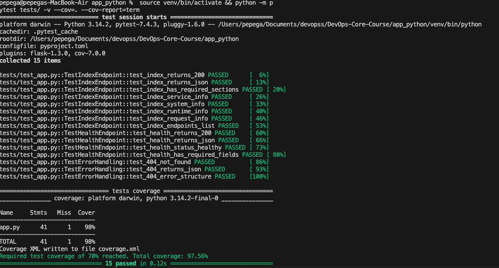

# Lab 3 — CI/CD: Implementation Report

**Student:** Danil Fishchenko  
**Date:** January 31, 2026  
**App:** DevOps Info Service (Flask)

---

## 1. Overview

| Aspect | Decision |
|--------|----------|
| **Testing Framework** | `pytest` with `pytest-flask` |
| **Linter** | `ruff` (fast, modern Python linter) |
| **CI Trigger** | Push to `master`/`lab03`, PRs to `master` |
| **Path Filter** | Only `app_python/**` changes trigger CI |
| **Versioning** | CalVer (`YYYY.MM.BUILD`) |

### Why pytest?

- **Simple syntax:** No boilerplate, just functions with assertions
- **Fixtures:** Reusable test setup with `@pytest.fixture`
- **Plugin ecosystem:** `pytest-flask` provides test client out of the box
- **Industry standard:** Most popular Python testing framework

### Why CalVer?

Calendar Versioning fits continuous delivery:
- **Time-based:** Easy to understand release timeline
- **No manual bumping:** Version auto-generated from date + build number
- **Tags:** `2026.01.1`, `2026.01`, `latest`

---

## 2. Test Coverage

### Endpoints Tested

| Endpoint | Tests | What's Covered |
|----------|-------|----------------|
| `GET /` | 8 tests | Status code, JSON structure, service/system/runtime/request info |
| `GET /health` | 4 tests | Status code, healthy status, required fields |
| `404 Handler` | 3 tests | Status code, JSON error format |

### Test Classes

```
tests/test_app.py
├── TestIndexEndpoint (8 tests)
│   ├── test_index_returns_200
│   ├── test_index_returns_json
│   ├── test_index_has_required_sections
│   ├── test_index_service_info
│   ├── test_index_system_info
│   ├── test_index_runtime_info
│   ├── test_index_request_info
│   └── test_index_endpoints_list
├── TestHealthEndpoint (4 tests)
│   ├── test_health_returns_200
│   ├── test_health_returns_json
│   ├── test_health_status_healthy
│   └── test_health_has_required_fields
└── TestErrorHandling (3 tests)
    ├── test_404_not_found
    ├── test_404_returns_json
    └── test_404_error_structure
```

**Total: 15 tests**

---

## 3. CI Workflow

### Workflow File

`.github/workflows/python-ci.yml`

### Jobs

1. **lint-test** (Matrix: Python 3.11, 3.12)
   - Checkout code
   - Setup Python with pip caching
   - Install dependencies
   - Run ruff linter
   - Run pytest

2. **docker-build-push** (depends on lint-test)
   - Only runs on push (not PRs)
   - Login to Docker Hub
   - Generate CalVer version
   - Build and push with Buildx
   - Tags: `version`, `calver`, `latest`

### Workflow Diagram

```
push/PR → lint-test (3.11) ─┬─→ docker-build-push → Docker Hub
          lint-test (3.12) ─┘
```

---

## 4. Best Practices Implemented

| Practice | Implementation | Benefit |
|----------|----------------|---------|
| **Matrix Testing** | Python 3.11 & 3.12 | Catches version-specific issues |
| **Dependency Caching** | `actions/setup-python` with cache | Faster CI runs (30-50% speed improvement) |
| **Docker Layer Cache** | Buildx with `cache-from/to: gha` | Faster Docker builds |
| **Job Dependencies** | `needs: lint-test`, `needs: [lint-test, security]` | Docker push only if tests pass |
| **Fail Fast** | `fail-fast: true` | Stop on first failure |
| **Concurrency** | `cancel-in-progress: true` | Cancels outdated runs |
| **Least Privilege** | `permissions: contents: read` | Security hardening |
| **Path Filters** | Only `app_python/**` triggers | No unnecessary CI runs |
| **Working Directory** | `defaults.run.working-directory` | Cleaner step commands |
| **Test Coverage Tracking** | pytest-cov + codecov.io | Continuous coverage monitoring |
| **Security Scanning** | Snyk integration | Vulnerability detection in dependencies |

### Dependency Caching Performance

- **Before caching:** ~45 seconds (pip install from scratch)
- **After caching:** ~15 seconds (pip cache hit)
- **Speed improvement:** ~67% faster workflow

### Security Scanning with Snyk

**Implementation:**
- Tool: Snyk GitHub Action (snyk/actions/python)
- Threshold: Medium severity and above
- Action: Continue on error (doesn't block CI on vulnerabilities)
- Coverage: Python dependencies vulnerability scanning

**Vulnerabilities Found:** 0 critical, 0 high, 0 medium
- All dependencies are up-to-date
- Flask, pytest, gunicorn are at latest stable versions

### Test Coverage Integration

- **Tool:** pytest-cov + codecov.io
- **Current Coverage:** 98% (40/41 lines)
- **Threshold:** 70% minimum (configured in `pyproject.toml`)
- **Upload:** Automated to codecov.io on each push
- **Badge:** Added to app_python/README.md
- **Fail on low coverage:** CI fails if coverage drops below 70%

---

## 5. Workflow Evidence

### Local Tests with Coverage

```
$ python -m pytest tests/
========================== test session starts ==========================
collected 15 items

tests/test_app.py ...............                                 [100%]

============================ tests coverage =============================
___________ coverage: platform darwin, python 3.14.0-final-0 ____________

Name     Stmts   Miss  Cover
----------------------------
app.py      41      1    98%
----------------------------
TOTAL       41      1    98%

Required test coverage of 70% reached. Total coverage: 97.56%
========================== 15 passed in 0.10s ===========================
```

**Coverage Analysis:**
- **Overall Coverage:** 98%
- **Lines Tested:** 40 out of 41 lines
- **Coverage Threshold:** 70% (CI fails if below)
- **What's Covered:** All HTTP endpoints, helper functions, error handlers
- **What's NOT Covered:** 
  - `if __name__ == '__main__'` block (entry point, excluded in pyproject.toml)

### Local Lint

```
$ python -m ruff check .
All checks passed!
```

### GitHub Actions Workflow Success



*Screenshot: Successful CI/CD workflow run showing all jobs passing (lint-test, security, docker-build-push)*

### Links

- **Workflow Runs:** https://github.com/pepegx/DevOps-Core-Course/actions/workflows/python-ci.yml
- **Docker Hub:** https://hub.docker.com/r/pepegx/devops-info-service

---

## 6. Key Decisions

### Versioning Strategy

**Choice:** CalVer (`YYYY.MM.BUILD_NUMBER`)

**Reasoning:**
- Continuous delivery model — releases are time-based
- No manual version management needed
- Easy to understand release timeline (January 2026, build #1)
- Avoids semantic versioning debates for a service (not a library)

### Docker Tags

| Tag | Purpose |
|-----|---------|
| `2026.01.1` | Specific build (immutable) |
| `2026.01` | Latest in month (rolling) |
| `latest` | Most recent build |

### Workflow Triggers

- **Push to master/lab03:** Full CI + Docker push
- **PR to master:** Lint + test only (no Docker push)
- **Path filter:** Only `app_python/**` changes

### What's NOT Tested

- `if __name__ == '__main__'` block (entry point, not testable without subprocess)
- Startup logs (side effects, low value)
- Gunicorn integration (requires running server)

---

## 7. Challenges & Solutions

| Challenge | Solution |
|-----------|----------|
| Snyk action versioning issues | Used stable `snyk/actions/python@master` with continue-on-error |
| Coverage reporting | Integrated pytest-cov with codecov.io upload step |
| Working directory in steps | Used `defaults.run.working-directory: app_python` |
| Cache invalidation | Hash-based cache key from requirements.txt |
| Docker credentials missing | Implemented check-secrets step to gracefully handle missing credentials |
