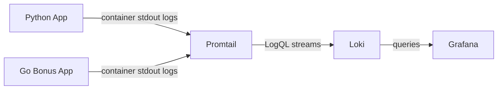

# Lab 7: Observability & Logging with Loki Stack

**Student:** `Danil Fishchenko`  
**Date:** `2026-03-12`  
**Branch:** `lab07`  
**Repository:** `pepegx/DevOps-Core-Course`

## Architecture



Main components:
- `monitoring/docker-compose.yml` runs Loki, Promtail, Grafana, Python app, and Go bonus app on a shared `lab07-logging` network.
- Promtail uses Docker service discovery and only scrapes containers with label `logging=promtail`.
- Loki stores logs locally with TSDB and filesystem object storage.
- Grafana provisions the Loki datasource and a ready-to-use Lab 7 dashboard from files in `monitoring/grafana/`.

## Setup Guide

1. Copy `monitoring/.env.example` to `monitoring/.env`.
2. Set `GF_SECURITY_ADMIN_PASSWORD` to a non-default password.
3. Optionally override `PYTHON_APP_IMAGE` and `BONUS_APP_IMAGE` if you want to use pushed images instead of the local default tags.
4. From repository root build app images:

```bash
docker build -t devops-info-service:lab07 ./app_python
docker build -t devops-info-service-go:lab07 ./app_go
```

5. Start the stack:

```bash
cd monitoring
docker compose --env-file .env up -d
docker compose ps
```

6. Verify:

```bash
curl http://localhost:3100/ready
curl http://localhost:9080/targets
curl http://localhost:3000/api/health
curl http://localhost:8000/health
curl http://localhost:8001/health
```

## Configuration

### Loki

File: `monitoring/loki/config.yml`

Key decisions:
- `schema: v13` with `store: tsdb` and `object_store: filesystem`
- `retention_period: 168h` for 7-day retention
- `compactor.retention_enabled: true` to enforce retention
- `analytics.reporting_enabled: false` to keep local lab setup predictable

Snippet:

```yaml
schema_config:
  configs:
    - from: 2024-01-01
      store: tsdb
      object_store: filesystem
      schema: v13

limits_config:
  retention_period: 168h
```

### Promtail

File: `monitoring/promtail/config.yml`

Key decisions:
- Docker service discovery via `/var/run/docker.sock`
- filter on `logging=promtail`
- relabel `container`, `app`, `logging`, `stream`
- `pipeline_stages.docker` to parse Docker log frames

Snippet:

```yaml
scrape_configs:
  - job_name: docker
    docker_sd_configs:
      - host: unix:///var/run/docker.sock
        filters:
          - name: label
            values: ["logging=promtail"]
```

### Grafana

Files:
- `monitoring/grafana/provisioning/datasources/loki.yml`
- `monitoring/grafana/provisioning/dashboards/dashboards.yml`
- `monitoring/grafana/dashboards/lab07-logs-dashboard.json`

Grafana starts with:
- Loki datasource provisioned automatically
- prebuilt dashboard for Lab 7
- anonymous auth disabled by default through `.env`

## Application Logging

File: `app_python/app.py`

Structured logging is implemented with the standard library `logging` module and a custom `JSONFormatter`.

Logged events:
- startup event with host, port, and debug mode
- every HTTP request with `method`, `path`, `status_code`, `client_ip`, `user_agent`, `duration_ms`
- 500 errors with request context

Example log line:

```json
{"timestamp":"2026-03-12T12:00:00+00:00","level":"INFO","logger":"devops-info-service","message":"request.completed","service":"devops-info-service","method":"GET","path":"/health","status_code":200,"client_ip":"127.0.0.1","duration_ms":1.73}
```

The Go bonus app is included in the stack and now supports a binary self-healthcheck flag for Docker health probes.

## Dashboard

Provisioned dashboard: `Lab 07 - Application Logs`

Panels:
1. **Recent Application Logs**  
   Query: `{app=~"devops-.*"}`
2. **Request Rate by App**  
   Query: `sum by (app) (rate({app=~"devops-.*"}[1m]))`
3. **Error Logs**  
   Query: `{app=~"devops-.*"} | json | level="ERROR"`
4. **Log Level Distribution**  
   Query: `sum by (level) (count_over_time({app=~"devops-.*"} | json [5m]))`

Useful ad-hoc LogQL queries:

```logql
{job="docker"}
{app="devops-python"}
{app="devops-python"} | json | method="GET"
{app="devops-python"} | json | status_code="404"
sum by (app) (rate({app=~"devops-.*"}[1m]))
```

## Production Config

Implemented hardening:
- anonymous Grafana auth disabled by default
- admin password moved to `.env` and ignored by Git
- health checks added for Loki, Promtail, Grafana, Python app, and Go app
- resource `limits` and `reservations` defined for each service
- Loki retention set to 7 days

Promtail note:
- the container image does not ship `wget` or `curl`
- the Docker healthcheck now uses `bash` + `/dev/tcp` to query the live Promtail endpoint at `http://127.0.0.1:9080/targets`
- the same `/targets` runtime endpoint is also used externally during local validation and in the Ansible bonus checks

## Testing

Manual checks:

```bash
cd monitoring
docker compose --env-file .env up -d
docker compose ps
curl http://localhost:3100/ready
curl http://localhost:9080/targets
curl http://localhost:3000/api/health
for i in {1..20}; do curl -s http://localhost:8000/ >/dev/null; done
for i in {1..20}; do curl -s http://localhost:8000/health >/dev/null; done
for i in {1..20}; do curl -s http://localhost:8001/health >/dev/null; done
```

Captured screenshots:
- `monitoring/docs/screenshots/01-explore-three-containers.png`
- `monitoring/docs/screenshots/02-python-json-logs.png`
- `monitoring/docs/screenshots/03-dashboard.png`
- `monitoring/docs/screenshots/04-grafana-login.png`

Captured on `2026-03-12`:
- `01-explore-three-containers.png` shows Grafana Explore with Loki logs over the last hour
- `02-python-json-logs.png` shows parsed JSON fields for the Python app logs
- `03-dashboard.png` shows the provisioned Lab 7 dashboard with live panels
- `04-grafana-login.png` shows Grafana login with anonymous auth disabled

## Challenges

1. **Lab files live on different branches**
   - Solution: implement Lab 7 on top of `origin/lab06`, not `master`.

2. **Python app in Lab 6 had no structured logging**
   - Solution: replace `print()` startup output with JSON logs from `logging`.

3. **Promtail label filtering must match LogQL queries**
   - Solution: push Docker labels `logging` and `app` into Loki labels through relabeling.

4. **Grafana security requirement conflicts with easy local testing**
   - Solution: provision datasource and dashboard automatically, but keep login enforced via `.env`.

5. **Go distroless image had no shell for health checks**
   - Solution: add a `--healthcheck` flag to the Go binary and use it in Compose.

## Evidence Status

Files and evidence are prepared for:
- stack deployment
- app integration
- dashboard provisioning
- production hardening
- bonus Ansible automation
- live screenshots from a real running stack
