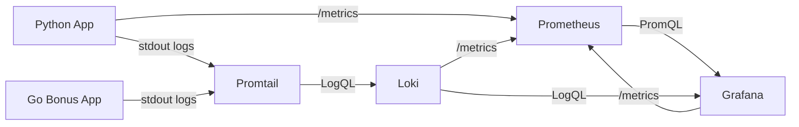

# Lab 8: Metrics & Monitoring with Prometheus

**Student:** `Danil Fishchenko`  
**Date:** `2026-03-19`  
**Branch:** `lab08`  
**Repository:** `pepegx/DevOps-Core-Course`

## Architecture



Main components:
- `app_python/app.py` exposes HTTP metrics on `/metrics` and keeps structured JSON logging from Lab 7.
- `monitoring/prometheus/prometheus.yml` configures Prometheus to scrape the Python app, Loki, Grafana, and itself every 15 seconds.
- `monitoring/docker-compose.yml` runs the full observability stack with persistence, healthchecks, and resource limits.
- Grafana provisions both the Loki and Prometheus datasources and auto-loads the Lab 7 logs dashboard plus the Lab 8 metrics dashboard.

## Application Instrumentation

### Added dependency

File: `app_python/requirements.txt`

```txt
prometheus-client==0.23.1
```

### Added metrics

File: `app_python/app.py`

Implemented metrics:
- `http_requests_total{method,endpoint,status_code}`  
  Counter for total HTTP requests by route and response status.
- `http_request_duration_seconds{method,endpoint}`  
  Histogram for request latency, used for p95 and latency trend charts.
- `http_requests_in_progress{method,endpoint}`  
  Gauge for active in-flight requests.
- `devops_info_endpoint_calls_total{endpoint}`  
  Application-specific counter for the service endpoints.
- `devops_info_system_collection_seconds`  
  Histogram tracking the time required to collect system information on `/`.

Implementation decisions:
- request labels use normalized endpoint names through `request.url_rule.rule`
- unmatched routes are grouped under `endpoint="unmatched"`
- `/metrics` is intentionally excluded from HTTP metrics to avoid self-scrape noise in RED charts
- `teardown_request` decrements the in-progress gauge even if request handling fails

Example metrics excerpt:

```text
http_requests_total{endpoint="/health",method="GET",status_code="200"} 13.0
http_requests_total{endpoint="unmatched",method="GET",status_code="404"} 2.0
http_requests_total{endpoint="/",method="GET",status_code="200"} 1.0

http_requests_in_progress{endpoint="/health",method="GET"} 0.0
http_requests_in_progress{endpoint="unmatched",method="GET"} 0.0
http_requests_in_progress{endpoint="/",method="GET"} 0.0

devops_info_endpoint_calls_total{endpoint="/health"} 13.0
devops_info_endpoint_calls_total{endpoint="/"} 1.0
devops_info_system_collection_seconds_count 1.0
```

## Prometheus Configuration

### Compose changes

File: `monitoring/docker-compose.yml`

Added service:
- `prometheus` using `prom/prometheus:v3.9.0`
- port `9090:9090`
- config mount `./prometheus/prometheus.yml:/etc/prometheus/prometheus.yml:ro`
- persistent volume `prometheus-data:/prometheus`
- retention flags:
  - `--storage.tsdb.retention.time=15d`
  - `--storage.tsdb.retention.size=10GB`

Additional stack changes:
- enabled Grafana metrics with `GF_METRICS_ENABLED=true`
- kept Loki, Promtail, Grafana, Python app, and Go app on the shared `lab07-logging` network
- added Prometheus labels so Promtail can also collect Prometheus logs

### Scrape configuration

File: `monitoring/prometheus/prometheus.yml`

Configured jobs:
- `prometheus` -> `localhost:9090`
- `app` -> `app-python:3000/metrics`
- `loki` -> `loki:3100/metrics`
- `grafana` -> `grafana:3000/metrics`

Important implementation note:
- from the host the Python app is reachable as `localhost:8000`
- from inside the Docker network Prometheus must scrape `app-python:3000`

### Verified Prometheus state

Verified locally on `2026-03-19`:
- `http://localhost:9090/-/healthy` returned `Prometheus Server is Healthy.`
- `http://localhost:9090/api/v1/query?query=up` returned four healthy targets:
  - `app-python:3000`
  - `localhost:9090`
  - `grafana:3000`
  - `loki:3100`

## Grafana Dashboards

### Datasources

File: `monitoring/grafana/provisioning/datasources/loki.yml`

Provisioned datasources:
- `Loki` with UID `loki`
- `Prometheus` with UID `prometheus`

Verified via Grafana API:
- `/api/datasources/uid/loki` returned `200`
- `/api/datasources/uid/prometheus` returned `200`

Reproducibility note:
- on a fresh `grafana-data` volume, `admin:change-me-now` worked immediately
- on a reused local `grafana-data` volume, the same API calls initially returned `401 Unauthorized` even though the container still started with `GF_SECURITY_ADMIN_PASSWORD=change-me-now`
- to reproduce the checks reliably, either start from a clean state with `docker compose --env-file .env.example down -v` or reset the persisted password in place with `docker exec grafana grafana cli admin reset-admin-password --user-id 1 change-me-now`

### Dashboard provisioning

Files:
- `monitoring/grafana/dashboards/lab07-logs-dashboard.json`
- `monitoring/grafana/dashboards/lab08-metrics-dashboard.json`
- `monitoring/grafana/provisioning/dashboards/dashboards.yml`

The metrics dashboard is automatically provisioned with UID `lab08-metrics` and title `Lab 08 - Metrics Overview`.

### Metrics dashboard walkthrough

Dashboard panels:
1. **Application Uptime**  
   Query: `up{job="app"}`
2. **Active Requests**  
   Query: `sum(http_requests_in_progress{endpoint!="/metrics"})`
3. **Request Rate by Endpoint**  
   Query: `sum by (endpoint) (rate(http_requests_total{endpoint!="/metrics"}[$__rate_interval]))`
4. **5xx Error Rate**  
   Query: `sum(rate(http_requests_total{status_code=~"5..",endpoint!="/metrics"}[$__rate_interval]))`
5. **p95 Request Duration by Endpoint**  
   Query: `histogram_quantile(0.95, sum by (le, endpoint) (rate(http_request_duration_seconds_bucket{endpoint!="/metrics"}[$__rate_interval])))`
6. **System Info Collection p95**  
   Query: `histogram_quantile(0.95, sum by (le) (rate(devops_info_system_collection_seconds_bucket[$__rate_interval])))`
7. **Status Code Distribution**  
   Query: `sum by (status_code) (rate(http_requests_total{endpoint!="/metrics"}[$__rate_interval]))`
8. **Endpoint Calls Total**  
   Query: `sum by (endpoint) (devops_info_endpoint_calls_total)`

## PromQL Examples

RED-focused PromQL examples used in this lab:

```promql
sum by (endpoint) (rate(http_requests_total{endpoint!="/metrics"}[5m]))

sum(rate(http_requests_total{status_code=~"5..",endpoint!="/metrics"}[5m]))

histogram_quantile(
  0.95,
  sum by (le, endpoint) (
    rate(http_request_duration_seconds_bucket{endpoint!="/metrics"}[5m])
  )
)

sum by (status_code) (rate(http_requests_total{endpoint!="/metrics"}[5m]))

up

histogram_quantile(
  0.95,
  sum by (le) (
    rate(devops_info_system_collection_seconds_bucket[5m])
  )
)
```

## Production Setup

Hardening applied:
- healthchecks on Loki, Promtail, Grafana, Prometheus, Python app, and Go app
- persistent volumes:
  - `loki-data`
  - `promtail-data`
  - `grafana-data`
  - `prometheus-data`
- resource limits:
  - Prometheus: `1 CPU`, `1G`
  - Loki: `1 CPU`, `1G`
  - Grafana: `0.5 CPU`, `512M`
  - Apps: `0.5 CPU`, `256M`
- Prometheus retention:
  - `15d`
  - `10GB`

## Testing Results

### Local stack verification

Commands used:

```bash
cd monitoring
docker compose --env-file .env.example config

# Optional clean-room rerun if you want Grafana to reinitialize its admin user
docker compose --env-file .env.example down -v

GF_METRICS_ENABLED=true PROMETHEUS_PORT=9090 \
PYTHON_APP_IMAGE=devops-info-service:lab08 \
BONUS_APP_IMAGE=devops-info-service-go:lab08 \
docker compose --env-file .env.example up -d --build

curl http://localhost:8000/health
curl http://localhost:8000/metrics
curl http://localhost:9090/-/healthy
curl 'http://localhost:9090/api/v1/query?query=up'
curl -u admin:change-me-now http://localhost:3000/api/datasources/uid/loki
curl -u admin:change-me-now http://localhost:3000/api/datasources/uid/prometheus
curl -u admin:change-me-now 'http://localhost:3000/api/search?query=Lab%2008'

# If you intentionally keep an existing grafana-data volume and the API returns 401,
# restore the expected password and rerun the Grafana API checks.
docker exec grafana grafana cli admin reset-admin-password --user-id 1 change-me-now

docker compose --env-file .env.example down
docker compose --env-file .env.example up -d
```

Observed results:
- `docker compose ps` showed all six services healthy
- the Python app exposed custom Prometheus metrics successfully
- Prometheus scraped all four required targets and reported them as `up`
- Grafana provisioned both datasources and the Lab 8 dashboard automatically
- Grafana API checks with `admin:change-me-now` were reproducible on a fresh volume and after an explicit password reset on a reused `grafana-data` volume
- after `docker compose down` and `docker compose up -d`, the dashboard remained discoverable and the stack came back healthy

### Code validation

Verified in the built Python image:

```bash
docker run --rm --user "$(id -u):$(id -g)" \
  -e COVERAGE_FILE=/tmp/.coverage \
  -v "$PWD":/app -w /app \
  devops-info-service:lab08 \
  python -m pytest -q -p no:cacheprovider \
  -o addopts='-q --cov=app --cov-report=term --cov-fail-under=70'

docker run --rm --user "$(id -u):$(id -g)" \
  -v "$PWD":/app -w /app \
  devops-info-service:lab08 \
  ruff check .
```

Results:
- `pytest`: `19 passed`
- coverage: `96.83%`
- `ruff`: `All checks passed!`

### Evidence files

Screenshots captured:
- `monitoring/docs/screenshots/08-metrics-endpoint.png`
- `monitoring/docs/screenshots/05-prometheus-targets.png`
- `monitoring/docs/screenshots/06-prometheus-query-up.png`
- `monitoring/docs/screenshots/07-metrics-dashboard.png`

Additional evidence:
- provisioned dashboard JSON: `monitoring/grafana/dashboards/lab08-metrics-dashboard.json`
- Prometheus config: `monitoring/prometheus/prometheus.yml`

## Metrics vs Logs

Logs from Lab 7 help answer:
- which request failed
- what the exact payload or error message was
- what happened inside one execution path

Metrics from Lab 8 help answer:
- how often requests arrive
- how many errors are happening over time
- whether latency is trending up
- whether the service is available right now

Practical rule:
- start with metrics to detect and scope the problem
- use logs to explain the exact failing request or code path

## Bonus: Ansible Automation

The monitoring role was extended to cover Lab 8:
- added Prometheus defaults and scrape targets
- added `prometheus.yml.j2`
- extended the compose template with the Prometheus service
- provisioned both Loki and Prometheus datasources
- added `lab08-metrics-dashboard.json` to the role
- extended deployment verification with Prometheus health, Grafana datasource checks, and automatic recovery of a stale persisted Grafana admin password

Files updated for the bonus:
- `ansible/roles/monitoring/defaults/main.yml`
- `ansible/roles/monitoring/tasks/setup.yml`
- `ansible/roles/monitoring/tasks/deploy.yml`
- `ansible/roles/monitoring/templates/docker-compose.yml.j2`
- `ansible/roles/monitoring/templates/grafana-datasource.yml.j2`
- `ansible/roles/monitoring/templates/prometheus.yml.j2`
- `ansible/roles/monitoring/files/lab08-metrics-dashboard.json`

Bonus validation performed locally:
- created a temporary Ansible venv in `/tmp/lab07-ansible-venv`
- installed required collections into `/tmp/lab07-ansible-collections`
- pushed the current `lab08` Python and Go images to the local registry at `localhost:5001`
- executed `ansible/playbooks/deploy-monitoring.yml` against `ansible/inventory/hosts.local-docker.ini`
- reran the same playbook and got `changed=0`, confirming idempotency
- intentionally changed the persisted Grafana admin password on the local target and verified that the next playbook run restored `monitoring_grafana_admin_password` and finished with `changed=1 failed=0`

## Challenges & Solutions

1. **The lab handout used `app-python:8000` in the scrape example**
   - Solution: use `app-python:3000` inside Docker Compose because `8000` is only the host-mapped port.

2. **`/metrics` traffic polluted application request metrics**
   - Solution: exclude `/metrics` from instrumentation and from RED-style dashboard queries.

3. **Prometheus retention example in the handout is easier to express as CLI flags**
   - Solution: configure retention through the Prometheus container command instead of inventing an invalid config-file section.

4. **Grafana API checks were not fully reproducible on reused `grafana-data`**
   - Solution: document the two supported recovery paths explicitly: `docker compose --env-file .env.example down -v` for a clean rerun, or `docker exec grafana grafana cli admin reset-admin-password --user-id 1 change-me-now` for an in-place reset.

5. **Grafana UI screenshots were blocked by login**
   - Solution: provision the dashboard automatically and create a public Grafana snapshot through the API for screenshot capture.

6. **Bonus playbook initially failed on the Prometheus image reference**
   - Solution: align the Ansible default with the working Compose image tag and use `prom/prometheus:v3.9.0` instead of the non-existent `prom/prometheus:3.9.0`.
